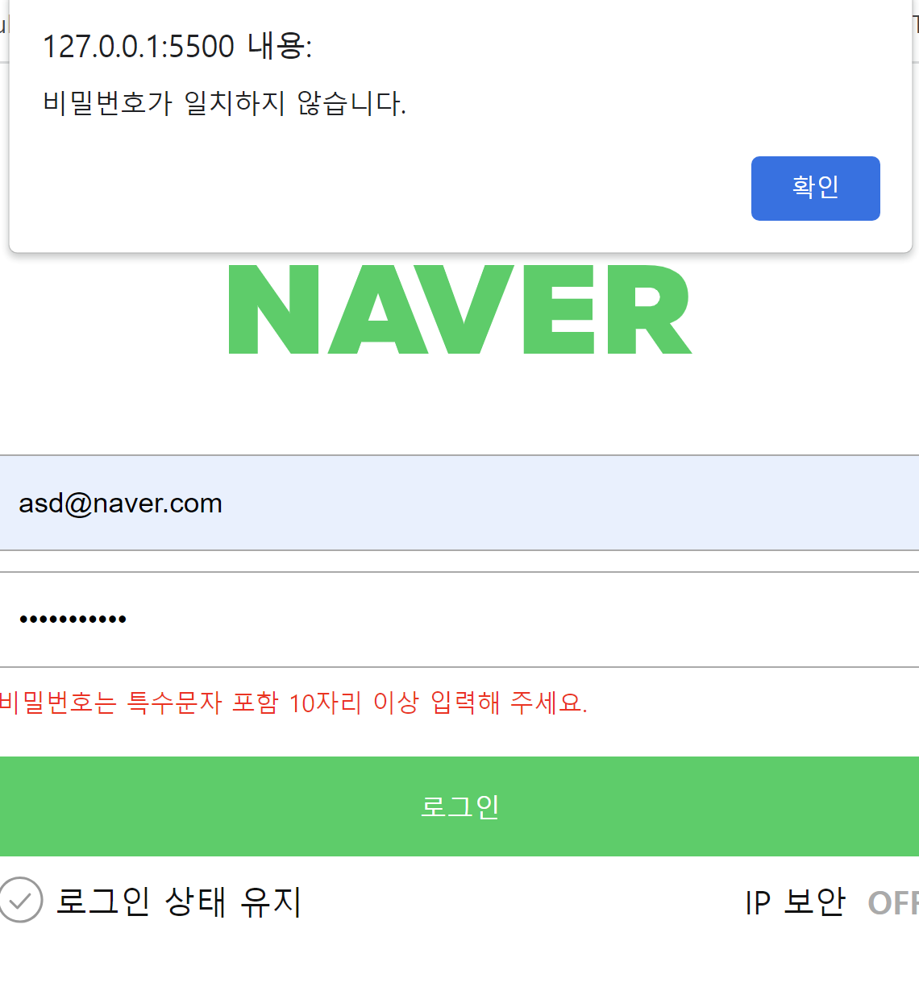
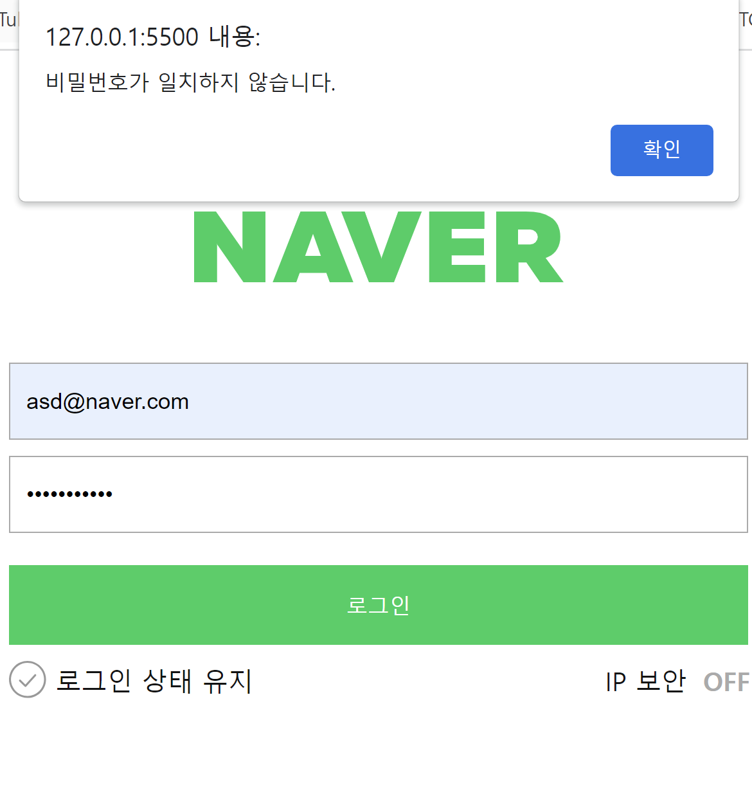
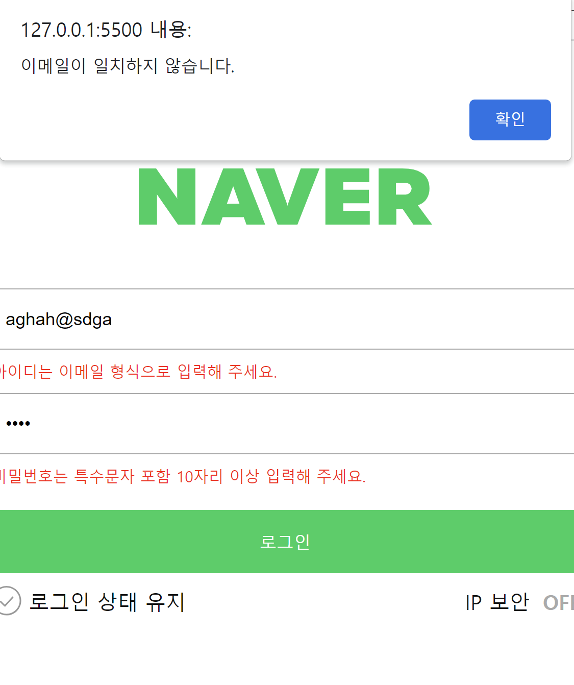
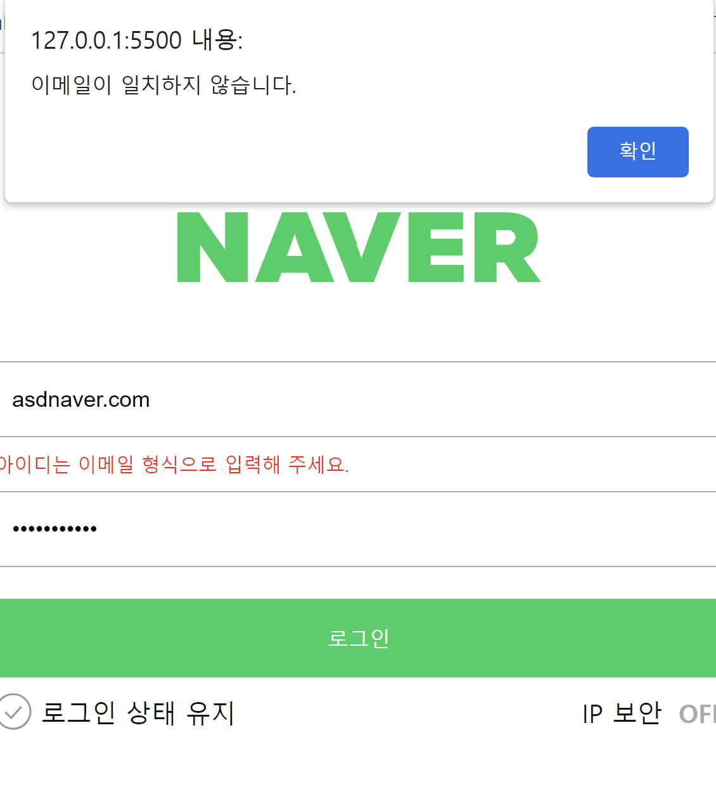

# 💚네이버 로그인 페이지 구현

---

### ✅프로젝트 기간: 2023.07.12 ~ 2023.07.16
### 시연 영상


### Skills

---

로그인과 비밀번호를 정확히 입력했을 때 welcome 페이지로 넘어갈 수 있도록 코드 로직을 작성합니다.

---

- [x] 재사용 가능한 함수를 분리하고 함수를 중심으로 설계하는 방법에 대해 학습합니다.

---

## 함수

함수를 사용할 때는 재사용성을 고려하여 만듭니다. 

## 조건문

로그인 코드 로직에서 조건문은 크게 중요한 역할을 합니다.

조건문을 사용하면 코드 로직을 간편하고 가독성을 향상시킬 수 있습니다.

(1) 사용자가 반환값과 이메일, 비밀번호 형태의 비교

```js
//이메일창의 값이 이메일 형태와 맞지 않게 입력된 경우
if (!emailReg(email.value)) {
  email.classList.add("is--invalid");
}

// 이메일 형태에 적합하게 입력된 경우
else {
  email.classList.remove("is--invalid");
}

//입력한 비밀번호가 6~16자가 아닌경우
if (!pwReg(pw.value)) {
  //여기 .value는 사용자가 입력한 pw의 값을 받아온다.
  pw.classList.add("is--invalid");
}

// 비밀번호 형태에 적합하게 입력된 경우
else {
  pw.classList.remove("is--invalid");
}
```

2. 사용자 반환 아이디, 패스워드와 지정된 아이디 패스워드를 조건문을 이용하여 비교한다.

```js
//이메일과 패스워드가 모두 일치하는 경우
if (user.id === email.value && user.pw === pw.value) {
  window.location.href = "welcome.html";
  email.classList.remove("is--invalid");
  pw.classList.remove("is--invalid");
}

//아이디는 일치하지만 패스워드는 일치하지 않는 경우
else if (user.id === email.value && user.pw !== pw.value) {
  email.classList.remove("is--invalid");
  alert("비밀번호가 일치하지 않습니다.");
}
//1. 아이디와 패스워드 모두 일치하지 않는 경우 , 아이디는 일치하지 않고 패스워드는 일치
else {
  alert("이메일이 일치하지 않습니다.");
}
```

## Rendering

dom 요소가 적을 수록, css 규칙이 작을 수록 dom tree가 작아지기 때문에 construction 과정이 빨라집니다.
그렇기에 불필요한 tag 남용을 지양했습니다.

1. 이메일과 패스워드가 모두 일치하는 경우
   

2. 아이디는 일치하지만 패스워드는 일치하지 않는 경우

(사용자가 반환한 비밀번호 값, 비밀번호 형식이 일치하지 않은 경우)


(사용자가 반환한 비밀번호 값은 일치하지 않지만 비밀번호 형식은 일치하는 경우)

비밀번호는 특수문자 포함 10자리를 포함하고 있다.

3. 아이디와 패스워드 모두 일치하지 않는 경우 , 아이디는 일치하지 않고 패스워드는 일치
   
   
